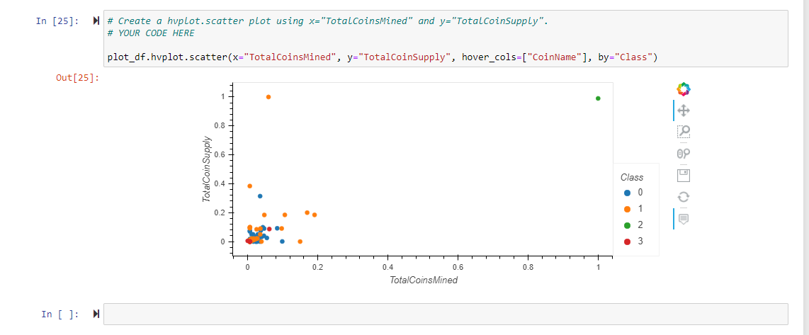
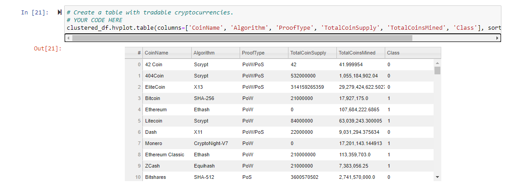
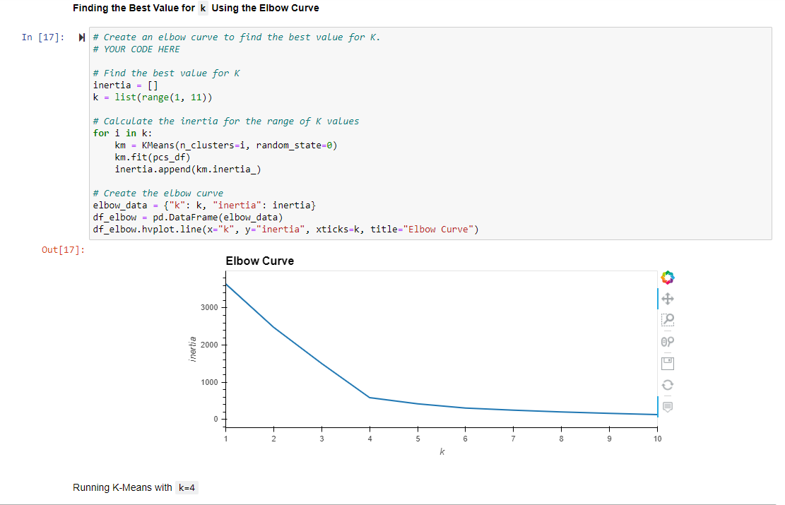

# Cryptocurrencies
## Purpose of analysis

This **cryptocurrency** dataset was analyzed using unsupervised learning. The data was preprocessed to undergo Principal Component Analysis (PCA), data dimensions were reduced using PCA, clustering of the cryptocurrencies occurred using the K-means algorithm, and the data was visualized using applicable plots. 

The following images show various visualizations of the PCA data including an Elbow Curve:

